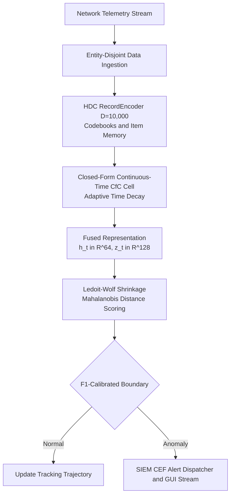

# HDC-LNN: Continuous-Time Neural Hyperdimensional Computing for Telemetry Anomaly Detection

[](https://www.python.org/downloads/)
[](https://pytorch.org/)
[](https://fastapi.tiangolo.com/)
[](https://opensource.org/licenses/MIT)

An end-to-end framework and empirical benchmark comparing **Continuous-Time Closed-Form Liquid Neural Networks combined with Hyperdimensional Computing (HDC-LNN)** against modern state-space, sequence, and tabular transformer models (**Mamba-2**, **1D-CNN**, **LSTM-Autoencoder**, **LSTM**, **FT-Transformer**, and **SAINT**) for line-rate cybersecurity network telemetry anomaly detection.

---

## Table of Contents
1. [Overview](#overview)
2. [Key Features](#key-features)
3. [Architecture](#architecture)
4. [Project Workflow](#project-workflow)
5. [Repository Structure](#repository-structure)
6. [Technologies](#technologies)
7. [System Requirements](#system-requirements)
8. [Installation and Setup](#installation-and-setup)
9. [Environment Configuration](#environment-configuration)
10. [Datasets](#datasets)
11. [Running the Baseline Benchmark Suite](#running-the-baseline-benchmark-suite)
12. [Running Individual Baseline Models](#running-individual-baseline-models)
13. [Interactive Web Dashboard](#interactive-web-dashboard)
14. [Encoder Geometric Separability Study](#encoder-geometric-separability-study)
15. [Batch Multi-Dataset Runner](#batch-multi-dataset-runner)
16. [Automated Testing](#automated-testing)
17. [Verification and Reproducibility](#verification-and-reproducibility)
18. [Troubleshooting](#troubleshooting)
19. [Limitations and Security](#limitations-and-security)
20. [Citation and Attribution](#citation-and-attribution)

---

## Overview

Network flow telemetry analysis operates under strict performance limits. Flow arrival rates frequently exceed tens of thousands of packets per second, inter-arrival times are irregular, and attack variants often introduce previously unseen categorical values.

HDC-LNN addresses these constraints through three connected components:
1. **Hyperdimensional Computing (HDC)**: Maps categorical protocol fields and continuous metrics into fixed-width 10,000-dimensional bipolar vectors using deterministic level codebooks and associative item memory in constant time.
2. **Liquid Neural Networks (LNN / CfC)**: Uses closed-form continuous-time differential equations with adaptive time constants to process irregular flow intervals.
3. **Reference Manifold and Linear Fusion**: Projects hidden states into a reference manifold stabilized by Ledoit-Wolf shrinkage, scoring anomalies using Mahalanobis distance.

All evaluated models stay below 3.5 million parameters, well within the 1-billion-parameter constraint for edge network devices.

---

## Key Features

- **Seven-Model Benchmark**: Evaluates HDC-LNN alongside Mamba-2 (Pure PyTorch SSM), 1D-CNN, LSTM-Autoencoder, Recurrent LSTM, FT-Transformer, and SAINT.
- **Strict Data Isolation**: Enforces entity-disjoint splits between training, validation, and testing. Codebooks fit only on benign training flows.
- **Low Streaming Latency**: Averages 59.2 microseconds per flow (approximately 16,889 flows per second) during single-flow CPU inference.
- **Web Dashboard**: Provides a browser interface built with FastAPI and WebSockets for monitoring score drift, testing synthetic attacks, and logging alerts.
- **Packaged Datasets**: Includes 41 network flow CSV datasets covering UNSW-NB15, KDD Cup 99, NSL-KDD, ToN-IoT, and IoT-23.

---

## Architecture



### Module breakdown:
- `hdlnn/hdc/`: Codebooks, item memory, and alternative encoders (SAX, RFF).
- `hdlnn/lnn/`: Closed-form continuous-time (CfC) recurrent cell and projection layer.
- `hdlnn/divergence/`: Manifold fitting with Ledoit-Wolf covariance shrinkage and Mahalanobis scoring.
- `hdlnn/baselines/`: Reference implementations for Mamba-2, 1D-CNN, LSTM-Autoencoder, LSTM, FT-Transformer, and SAINT.
- `hdlnn/deploy/`: Dashboard server, streaming sidecar daemon, ring-buffer queue, and alert logger.

---

## Project Workflow

1. **Data Ingestion**: The loader partitions network flows into entity-disjoint subsets.
2. **HDC Vectorization**: Categorical fields and numerical metrics are bound into 10,000-dimensional hypervectors.
3. **Continuous-Time Propagation**: Sequences pass through the CfC cell alongside inter-arrival times.
4. **Validation Calibration**: Normal validation flows fit the Ledoit-Wolf covariance manifold and set the decision threshold by maximizing the validation F1 score.
5. **Streaming Evaluation**: The system evaluates test flows sequentially, writing per-flow drift scores and decisions to `decisions.parquet` and `metrics.json`.

---

## Repository Structure

```text
HDC-LNN2/
├── configs/                            # Dataset and pipeline configuration files
│   ├── base.yaml                       # Global hyperparameters and seeds
│   ├── dataset_unsw_nb15.yaml          # UNSW-NB15 schema configuration
│   ├── dataset_kdd.yaml                # KDD Cup and NSL-KDD schema configuration
│   ├── dataset_ton_iot.yaml            # ToN-IoT schema configuration
│   └── dataset_iot23.yaml              # IoT-23 schema configuration
├── datasets/                           # Benchmark flow datasets
│   ├── README.md                       # Dataset inventory
│   ├── SOURCES.md                      # Source citations and download links
│   ├── UNSW_NB15_testing-set.csv       # Primary 30,000-flow benchmark
│   └── ...                             # 41 CSV datasets
├── hdlnn/                              # Main Python package
│   ├── baselines/                      # Comparison models (Mamba-2, CNN, AE, LSTM, Transformers)
│   ├── common/                         # Configuration loading, logging, and parameter counting
│   ├── contracts/                      # Data schemas
│   ├── data/                           # Loaders and splitters
│   ├── deploy/                         # Dashboard server, static assets, and alert logger
│   ├── divergence/                     # Manifold fitting and Mahalanobis scoring
│   ├── eval/                           # Experiment runner, calibration, and metrics
│   ├── hdc/                            # Hyperdimensional encoding and item memory
│   ├── lnn/                            # Closed-form liquid neural cells
│   └── pipeline.py                     # Command-line entry point
├── experiments/                        # Verification and evaluation scripts
│   ├── run_instantaneous_temporal_fusion.py
│   ├── run_manifold_shrinkage_study.py
├── results/                            # Verified benchmark summaries
│   ├── canonical_benchmark_results.json # Full replication metrics
│   ├── MODEL_CARD.md                   # Model specification card
│   ├── replicated_fusion_metrics.json  # Multi-seed metrics summary
│   ├── manifold_shrinkage_kdd.json     # Covariance comparison on KDD
│   └── manifold_shrinkage_unsw.json    # Covariance comparison on UNSW
├── tests/                              # Automated test suite
├── .github/workflows/ci.yml            # CI configuration
├── .env.example                        # Environment template
├── .gitignore                          # Ignored directories and build artifacts
├── BENCHMARK_COMPARISON.md         # Multi-model comparative benchmark
├── BENCHMARK_INTEGRITY_AUDIT.md    # Independent integrity audit report
├── CHANGELOG.md                    # Chronological iteration and results log
├── REPLICATION_RESULTS.md          # Replicated 4-seed evaluation report
├── run_all_baselines.py            # Multi-model evaluation script
├── run_all_datasets.py             # Multi-dataset batch evaluation script
├── evaluate_encoder_separability.py # Encoder geometric study script
└── README.md                       # Project operating manual
```

---

## Technologies

- Core: Python 3.10+, PyTorch 2.0+
- Scientific libraries: NumPy, SciPy, Pandas, Scikit-learn, PyArrow
- Web services: FastAPI, Uvicorn, WebSockets
- Configuration and plotting: PyYAML, Psutil, Matplotlib
- Testing: Pytest, Pytest-cov

---

## System Requirements

### Hardware
- CPU: x86_64 or Apple Silicon (arm64). Single-core CPU streaming inference reaches approximately 16,000 flows per second.
- RAM: Minimum 8 GB (16 GB recommended for full-scale evaluations on 30,000 contiguous flows).
- Disk space: Approximately 4.5 GB total for code, dependencies, and all 41 benchmark flow datasets.

### Software
- Operating system: macOS, Linux, or Windows (WSL2 recommended on Windows).
- Python: Version 3.10, 3.11, 3.12, or 3.13.

---

## Installation and Setup

### 1. Clone the repository
```bash
git clone https://github.com/XxDiLiPxX/HDC-LNN2.git
cd HDC-LNN2
```

### 2. Create and activate a virtual environment
```bash
# macOS / Linux
python3 -m venv .venv
source .venv/bin/activate

# Windows (Command Prompt / PowerShell)
python -m venv .venv
.\.venv\Scripts\activate
```

### 3. Install dependencies
Install the package in editable mode with development dependencies:
```bash
pip install --upgrade pip
pip install -e ".[dev]"
```

---

## Environment Configuration

Copy the provided `.env.example` template:
```bash
cp .env.example .env
```

| Variable | Default | Purpose |
| :--- | :--- | :--- |
| `HDC_LNN_HOST` | `127.0.0.1` | Host address for the web server |
| `HDC_LNN_PORT` | `8050` | Port for the dashboard |
| `HDC_LNN_LOG_LEVEL` | `INFO` | Console and runtime logging verbosity |
| `HDC_LNN_SEED` | `42` | Random seed for evaluation |
| `HDC_LNN_ALERT_LOG` | `soar_alerts.log` | File path for CEF-formatted alerts |

---

## Datasets

Primary benchmark datasets are included directly in the `datasets/` directory:
- UNSW-NB15: `UNSW_NB15_testing-set.csv` (15 MB, primary 30,000-flow benchmark).
- KDD and NSL-KDD: `kdd_test.csv` (3.1 MB, primary KDD evaluation dataset).
- ToN-IoT: `ton-iot.csv` (IoT network telemetry dataset).

For download links, schema mappings, and citations for extended captures (IoT-23, UNSW Botnet, and multi-part raw flow dumps), see [`datasets/SOURCES.md`](datasets/SOURCES.md).

---

## Running the Baseline Benchmark Suite

The primary script is [`run_all_baselines.py`](run_all_baselines.py). It evaluates all seven architectures under deterministic seeding and entity-disjoint isolation.

### 1. Fast smoke test
Runs 5,000 flows with 1 epoch for rapid validation:
```bash
python run_all_baselines.py --quick
```

### 2. Full benchmark on UNSW-NB15
Evaluates 30,000 contiguous flows with validation manifold calibration:
```bash
python run_all_baselines.py --dataset UNSW_NB15_testing-set.csv
```

### 3. Benchmark on NSL-KDD
```bash
python run_all_baselines.py --dataset kdd_test.csv
```

---

## Running Individual Baseline Models

Execute a single architecture directly using [`hdlnn.pipeline`](hdlnn/pipeline.py):

```bash
# Evaluate HDC-LNN
python -m hdlnn.pipeline --mode eval --baseline hdc-lnn --source-file datasets/UNSW_NB15_testing-set.csv

# Evaluate Mamba-2 (Pure PyTorch SSM)
python -m hdlnn.pipeline --mode eval --baseline mamba2 --source-file datasets/UNSW_NB15_testing-set.csv

# Evaluate 1D-CNN
python -m hdlnn.pipeline --mode eval --baseline cnn --source-file datasets/UNSW_NB15_testing-set.csv

# Evaluate FT-Transformer
python -m hdlnn.pipeline --mode eval --baseline ft-transformer --source-file datasets/UNSW_NB15_testing-set.csv
```

Supported baselines: `hdc-lnn`, `mamba2`, `cnn`, `autoencoder`, `lstm`, `ft-transformer`, and `saint`.

---

## Interactive Web Dashboard

Launch the browser control center:
```bash
python -m hdlnn.pipeline --mode gui --port 8050
```
Open `http://localhost:8050` in a browser.

Features:
- Drift monitoring: Real-time Mahalanobis divergence score charts with anomaly threshold lines.
- Flow rate control: Start, pause, and adjust flow ingestion rate.
- Threat injection: Inject synthetic DNS low-and-slow and lateral movement attacks during streaming.
- Alert feed: Displays incident containment alerts in Common Event Format (CEF).

---

## Encoder Geometric Separability Study

Measure geometric separation between normal and attack traffic in hyperspace before training:
```bash
python evaluate_encoder_separability.py --limit 5000
```
This computes centroid cosine distance, normalized Euclidean distance, Fisher ratio, and separability margin across `RecordEncoder` (HDC), `SAXEncoder`, and `RFFEncoder`.

---

## Batch Multi-Dataset Runner

Evaluate HDC-LNN across all datasets in `datasets/`:
```bash
python run_all_datasets.py
```
This writes summary statistics to `DATASET_EVALUATION_SUMMARY.md`.

---

## Automated Testing

Run the test suite:
```bash
pytest
```
All 20 tests pass in approximately 2 seconds, checking encoder parity, manifold fitting, temporal splitters, SIMD fallback, and threat injectors.

---

## Verification and Reproducibility Checklist

To verify the setup:
1. Clone the repository and enter the directory.
2. Create and activate a virtual environment.
3. Install dependencies with `pip install -e ".[dev]"`.
4. Run `pytest` to confirm all 20 tests pass.
5. Run `python run_all_baselines.py --quick` to test the benchmark suite across all seven models.
6. Run `python evaluate_encoder_separability.py --limit 1000` to verify hyperspace metric calculation.

---

## Troubleshooting

- Port already in use: Specify another port with `--port`, for example `python -m hdlnn.pipeline --mode gui --port 8055`.
- Dataset file not found: Run commands from the repository root. Scripts default to looking in `datasets/<filename>`.
- High memory usage: Use `--limit 5000` on machines with limited RAM to reduce the sequence buffer size.

---

## Limitations and Security

- Scope: Designed for flow-level network telemetry (NetFlow, IPFIX, Zeek). It operates on aggregated flow features rather than deep packet inspection (DPI) of raw payloads.
- Timing variance: Latency measurements vary by a few microseconds across runs depending on operating system thread scheduling.
- Security: Telemetry records do not contain plain-text credentials. Do not commit `.env` files if they contain sensitive host details.

---

## Citation and Attribution

If you use this benchmark or framework in your work, please cite:

```bibtex
@misc{hdclnn2025,
  title={HDC-LNN: Continuous-Time Neural Hyperdimensional Computing for Telemetry Anomaly Detection},
  author={HDC-LNN Research Group},
  year={2025},
  howpublished={\url{https://github.com/XxDiLiPxX/HDC-LNN2}}
}
```
